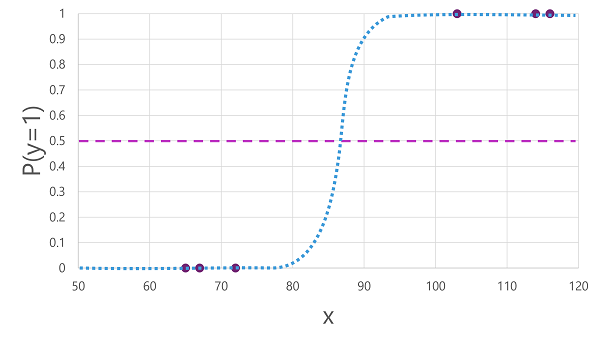
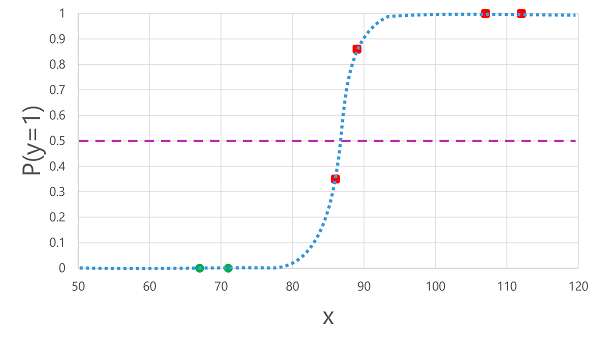
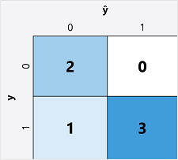
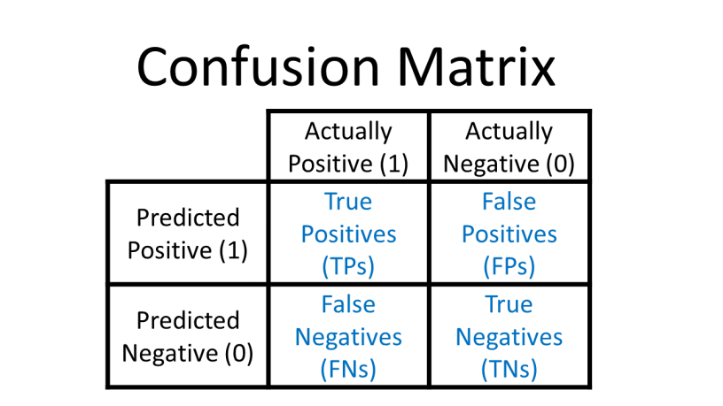

# Binary classification

Classification, like regression, is a supervised machine learning technique; and therefore follows the same iterative process of training, validating, and evaluating models. Instead of calculating numeric values like a regression model, the algorithms used to train classification models calculate probability values for class assignment and the evaluation metrics used to assess model performance compare the predicted classes to the actual classes.

Binary classification algorithms are used to train a model that predicts one of two possible labels for a single class. Essentially, predicting true or false. In most real scenarios, the data observations used to train and validate the model consist of multiple feature (x) values and a y value that is either 1 or 0.

# Example - binary classification

To understand how binary classification works, let's look at a simplified example that uses a single feature (x) to predict whether the label y is 1 or 0. In this example, we'll use the blood glucose level of a patient to predict whether or not the patient has diabetes. Here's the data with which we'll train the model:

| **Blood glucose (x)** | **Diabetic? (y)** |
| --------------------- | ----------------- |
| 67                    | 0                 |
| 103                   | 1                 |
| 114                   | 1                 |
| 72                    | 0                 |
| 116                   | 1                 |
| 65                    | 0                 |

# Training a binary classification model

To train the model, we'll use an algorithm to fit the training data to a function that calculates the probability of the class label being true (in other words, that the patient has diabetes). Probability is measured as a value between 0.0 and 1.0, such that the total probability for all possible classes is 1.0. So for example, if the probability of a patient having diabetes is 0.7, then there's a corresponding probability of 0.3 that the patient isn't diabetic.

There are many algorithms that can be used for binary classification, such as logistic regression, which derives a sigmoid (S-shaped) function with values between 0.0 and 1.0, like this:

>[!Note]
Despite its name, in machine learning logistic regression is used for classification, not regression. The important point is the logistic nature of the function it produces, which describes an S-shaped curve between a lower and upper value (0.0 and 1.0 when used for binary classification).

The function produced by the algorithm describes the probability of y being true (y=1) for a given value of x. Mathematically, you can express the function like this:

$f(x) = P(y=1 | x)$

For three of the six observations in the training data, we know that y is definitely true, so the probability for those observations that y=1 is 1.0 and for the other three, we know that y is definitely false, so the probability that y=1 is 0.0. The S-shaped curve describes the probability distribution so that plotting a value of x on the line identifies the corresponding probability that y is 1.

The diagram also includes a horizontal line to indicate the threshold at which a model based on this function will predict true (1) or false (0). The threshold lies at the mid-point for y (P(y) = 0.5). For any values at this point or above, the model will predict true (1); while for any values below this point it will predict false (0). For example, for a patient with a blood glucose level of 90, the function would result in a probability value of 0.9. Since 0.9 is higher than the threshold of 0.5, the model would predict true (1) - in other words, the patient is predicted to have diabetes.

# Evaluating a binary classification model

As with regression, when training a binary classification model you hold back a random subset of data with which to validate the trained model. Let's assume we held back the following data to validate our diabetes classifier:

|Blood glucose (x)|Diabetic? (y)|
|---|---|
|66|0|
|107|1|
|112|1|
|71|0|
|87|1|
|89|1|

Applying the logistic function we derived previously to the x values results in the following plot.

Based on whether the probability calculated by the function is above or below the threshold, the model generates a predicted label of 1 or 0 for each observation. We can then compare the predicted class labels (ŷ) to the actual class labels (y), as shown here:

| Blood glucose (x) | Actual diabetes diagnosis (y) | Predicted diabetes diagnosis (ŷ) |
| ----------------- | ----------------------------- | -------------------------------- |
| 66                | 0                             | 0                                |
| 107               | 1                             | 1                                |
| 112               | 1                             | 1                                |
| 71                | 0                             | 0                                |
| 87                | 1                             | 0                                |
| 89                | 1                             | 1                                |

# Binary classification evaluation metrics
The first step in calculating evaluation metrics for a binary classification model is usually to create a matrix of the number of correct and incorrect predictions for each possible class label:

This visualization is called a confusion matrix, and it shows the prediction totals where:

- ŷ=0 and y=0: True negatives (TN)
- ŷ=1 and y=0: False positives (FP)
- ŷ=0 and y=1: False negatives (FN)
- ŷ=1 and y=1: True positives (TP)

The arrangement of the confusion matrix is such that correct (true) predictions are shown in a diagonal line from top-left to bottom-right. Often, color-intensity is used to indicate the number of predictions in each cell, so a quick glance at a model that predicts well should reveal a deeply shaded diagonal trend.

>[! ตัวอย่างเพื่อความเข้าใจ]
>าที่คาดการณ์จากโมเดล ซึ่งก่อนอื่นขอพาทุกท่านไปรู้จักองค์ประกอบของตาราง (แสดงในตารางที่ 1) ดังนี้:
>- True Negative (TN): คือจำนวนครั้งที่โมเดลทำนายว่าไม่ใช่ และจริงๆแล้วก็ไม่ใช่ เช่น Model ทำนายว่าผู้ชายไม่ได้ท้อง (Negative) ซึ่งผลจริงคือผู้ชายไม่ได้ท้อง (True)
>- False Positive (FP) หรือ Type 1 error: จำนวนครั้งที่โมเดลทำนายว่าเป็น แต่จริงๆแล้วไม่ใช่ เช่น Model ทำนายว่าผู้ชายท้อง (Positive) ซึ่งผลจริงคือผู้ชายไม่ได้ท้อง (False)
>- False Negative (FN) หรือ Type 2 error: จำนวนครั้งที่โมเดลทำนายว่าไม่ใช่ แต่จริงๆแล้วเป็น เช่น ทำนายว่าผู้หญิงไม่ได้ท้อง (Negative) ซึ่งผลจริงคือผู้หญิงท้อง (False)
>- True Positive (TP): จำนวนครั้งที่โมเดลทำนายว่าเป็น และจริงๆแล้วก็เป็น เช่น Model ทำนายว่าผู้หญิงท้อง (Positive) ซึ่งผลจริงคือ ผู้หญิงท้อง (True)

## Accuracy
The simplest metric you can calculate from the confusion matrix is accuracy - the proportion of predictions that the model got right. Accuracy is calculated as:

***(TN+TP) ÷ (TN+FN+FP+TP)***

In the case of our diabetes example, the calculation is:

(2+3) ÷ (2+1+0+3)

= 5 ÷ 6

= 0.83

So for our validation data, the diabetes classification model produced correct predictions 83% of the time.

Accuracy might initially seem like a good metric to evaluate a model, but consider this. Suppose 11% of the population has diabetes. You could create a model that always predicts 0, and it would achieve an accuracy of 89%, even though it makes no real attempt to differentiate between patients by evaluating their features. What we really need is a deeper understanding of how the model performs at predicting 1 for positive cases and 0 for negative cases.

## Recall

Recall is a metric that measures the proportion of positive cases that the model identified correctly. In other words, compared to the number of patients who have diabetes, how many did the model predict to have diabetes?

The formula for recall is:

***TP ÷ (TP+FN)***

For our diabetes example:

3 ÷ (3+1)

= 3 ÷ 4

= 0.75

So our model correctly identified 75% of patients who have diabetes as having diabetes.

## Precision

Precision is a similar metric to recall, but measures the proportion of predicted positive cases where the true label is actually positive. In other words, what proportion of the patients predicted by the model to have diabetes actually have diabetes?

The formula for precision is:

***TP ÷ (TP+FP)***

For our diabetes example:

3 ÷ (3+0)

= 3 ÷ 3

= 1.0

So 100% of the patients predicted by our model to have diabetes do in fact have diabetes.

## F1-score

F1-score is an overall metric that combined recall and precision. The formula for F1-score is:

***(2 x Precision x Recall) ÷ (Precision + Recall)***

For our diabetes example:

(2 x 1.0 x 0.75) ÷ (1.0 + 0.75)

= 1.5 ÷ 1.75

= 0.86

