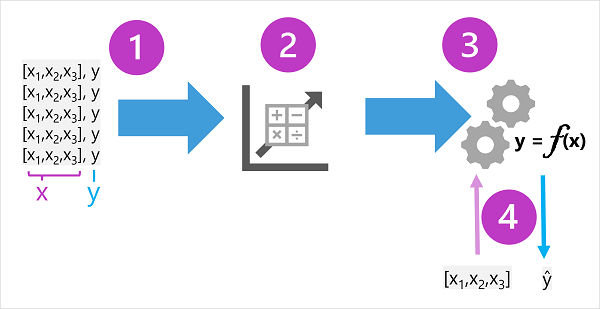

# Machine Learning

Machine learning has its origins in statistics and mathematical modeling of data. The fundamental idea of machine learning is to use data from past observations to predict unknown outcomes or values.

## ML as a function

a machine learning model is a software application that encapsulates a function to calculate an output value based on one or more input values. The process of defining that function is known as training. After the function has been defined, you can use it to predict new values in a process called inferencing.

