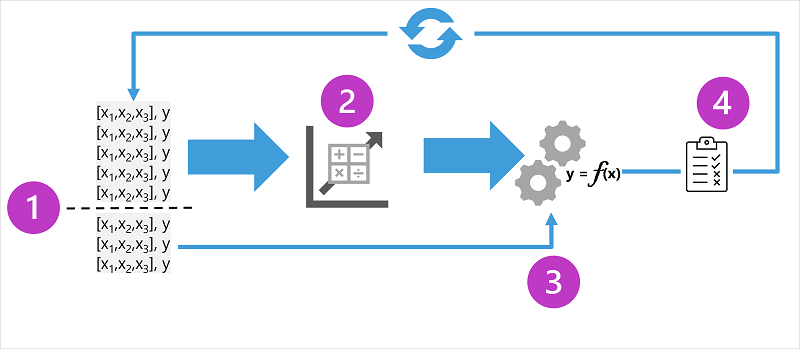
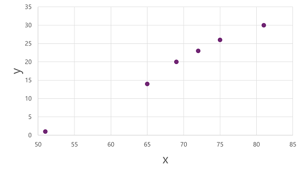
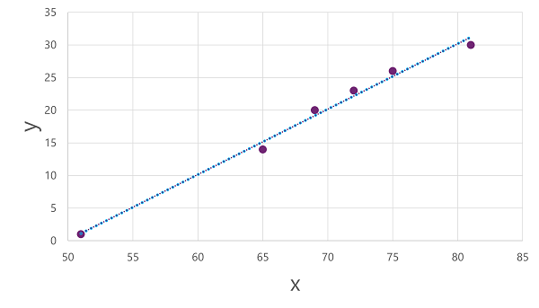
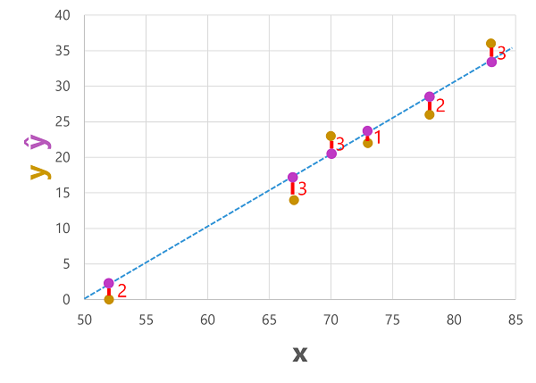

# Regression
Regression models are trained to predict numeric label values based on training data that includes both features and known labels. The process for training a regression model (or indeed, any supervised machine learning model) involves multiple iterations in which you use an appropriate algorithm (usually with some parameterized settings) to train a model, evaluate the model's predictive performance, and refine the model by repeating the training process with different algorithms and parameters until you achieve an acceptable level of predictive accuracy.

The diagram shows four key elements of the training process for supervised machine learning models:

1. Split the training data (randomly) to create a dataset with which to train the model while holding back a subset of the data that you'll use to validate the trained model.
2. Use an algorithm to fit the training data to a model. In the case of a regression model, use a regression algorithm such as linear regression.
3. Use the validation data you held back to test the model by predicting labels for the features.
4. Compare the known actual labels in the validation dataset to the labels that the model predicted. Then aggregate the differences between the predicted and actual label values to calculate a metric that indicates how accurately the model predicted for the validation data.

After each train, validate, and evaluate iteration, you can repeat the process with different algorithms and parameters until an acceptable evaluation metric is achieved.

## Example - regression

Let's explore regression with a simplified example in which we'll train a model to predict a numeric label (y) based on a single feature value (x). Most real scenarios involve multiple feature values, which adds some complexity; but the principle is the same.

For our example, let's stick with the ice cream sales scenario we discussed previously. For our feature, we'll consider the temperature (let's assume the value is the maximum temperature on a given day), and the label we want to train a model to predict is the number of ice creams sold that day. We'll start with some historic data that includes records of daily temperatures (x) and ice cream sales (y):

|Temperature (x)|Ice cream sales (y)|
|----|----|
|51|1|
|52|0|
|67|14|
|65|14|
|70|23|
|69|20|
|72|23|
|75|26|
|73|22|
|81|30|
|78|26|
|83|36|

## Training a regression model

We'll start by splitting the data and using a subset of it to train a model. Here's the training dataset:

|Temperature (x)|Ice cream sales (y)|
|---|---|
|51|1|
|65|14|
|69|20|
|72|23|
|75|26|
|81|30|

To get an insight of how these x and y values might relate to one another, we can plot them as coordinates along two axes, like this:

Now we're ready to apply an algorithm to our training data and fit it to a function that applies an operation to x to calculate y. One such algorithm is linear regression, which works by deriving a function that produces a straight line through the intersections of the x and y values while minimizing the average distance between the line and the plotted points, like this:

The line is a visual representation of the function in which the slope of the line describes how to calculate the value of y for a given value of x. The line intercepts the x axis at 50, so when x is 50, y is 0. As you can see from the axis markers in the plot, the line slopes so that every increase of 5 along the x axis results in an increase of 5 up the y axis; so when x is 55, y is 5; when x is 60, y is 10, and so on. To calculate a value of y for a given value of x, the function simply subtracts 50; in other words, the function can be expressed like this:

$f(x) = x-50$

ou can use this function to predict the number of ice creams sold on a day with any given temperature. For example, suppose the weather forecast tells us that tomorrow it will be 77 degrees. We can apply our model to calculate 77-50 and predict that we'll sell 27 ice creams tomorrow.

But just how accurate is our model?

## Evaluating a regression model
To validate the model and evaluate how well it predicts, we held back some data for which we know the label (y) value. Here's the data we held back:

| Temperature (x) | Ice cream sales (y) |
| --------------- | ------------------- |
| 52              | 0                   |
| 67              | 14                  |
| 70              | 23                  |
| 73              | 22                  |
| 78              | 26                  |
| 83              | 36                  |

We can use the model to predict the label for each of the observations in this dataset based on the feature (x) value; and then compare the predicted label (ŷ) to the known actual label value (y).

Using the model we trained earlier, which encapsulates the function f(x) = x-50, results in the following predictions:

|Temperature (x)|Actual sales (y)|Predicted sales (ŷ)|
|---|---|---|
|52|0|2|
|67|14|17|
|70|23|20|
|73|22|23|
|78|26|28|
|83|36|33|

We can plot both the predicted and actual labels against the feature values like this:

The predicted labels are calculated by the model so they're on the function line, but there's some variance between the ŷ values calculated by the function and the actual y values from the validation dataset; which is indicated on the plot as a line between the ŷ and y values that shows how far off the prediction was from the actual value.

# Regression evaluation metrics
Based on the differences between the predicted and actual values, you can calculate some common metrics that are used to evaluate a regression model.

## Mean Absolute Error (MAE)
The variance in this example indicates by how many ice creams each prediction was wrong. It doesn't matter if the prediction was over or under the actual value (so for example, -3 and +3 both indicate a variance of 3). This metric is known as the absolute error for each prediction, and can be summarized for the whole validation set as the mean absolute error (MAE).

In the ice cream example, the mean (average) of the absolute errors (2, 3, 3, 1, 2, and 3) is 2.33.

## Mean Squared Error (MSE)
The mean absolute error metric takes all discrepancies between predicted and actual labels into account equally. However, it may be more desirable to have a model that is consistently wrong by a small amount than one that makes fewer, but larger errors. One way to produce a metric that "amplifies" larger errors by squaring the individual errors and calculating the mean of the squared values. This metric is known as the mean squared error (MSE).

In our ice cream example, the mean of the squared absolute values (which are 4, 9, 9, 1, 4, and 9) is 6.

